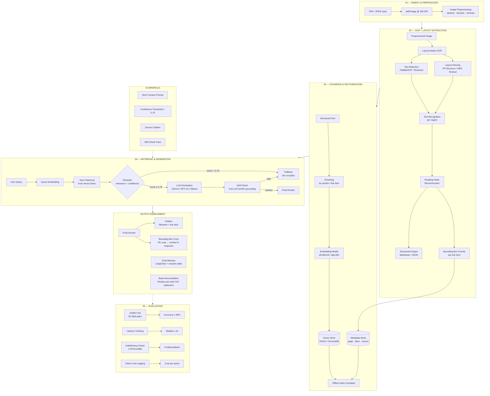
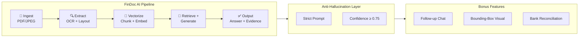
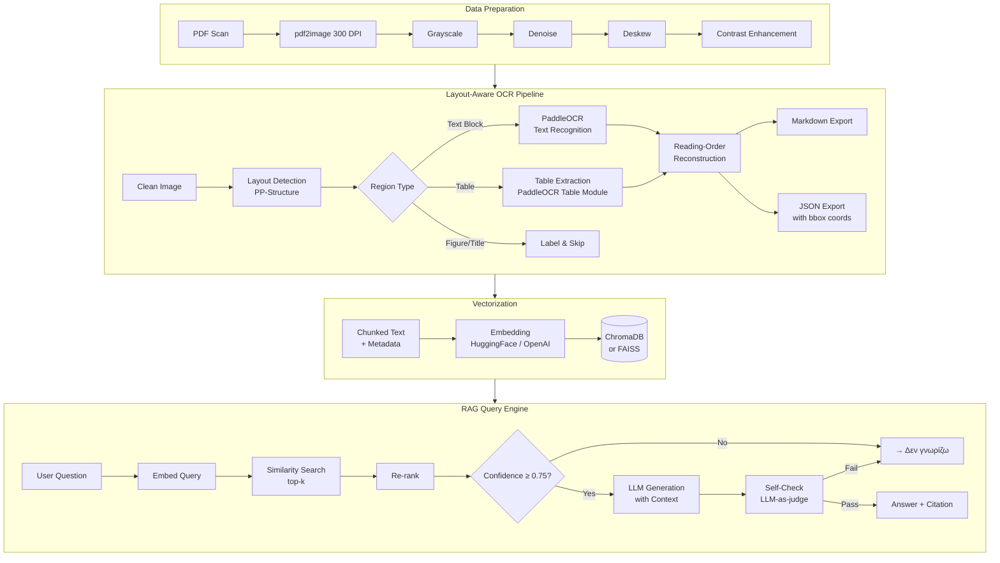

# FinDoc AI — Architecture Flowchart (Mermaid)

Copy the diagram block below into [draw.io](https://app.diagrams.net) (Insert → Advanced → Mermaid) or any Mermaid-compatible editor.

---

---

## Alternative: Horizontal Layout (better for wide screens)

---

## Individual Component Flow (detailed)

---

## How to use with drawio

1. Open [app.diagrams.net](https://app.diagrams.net)
2. Click **Arrange** → **Insert** → **Advanced** → **Mermaid**
3. Paste any of the diagrams above
4. Click **Insert** — the diagram will render as editable shapes
